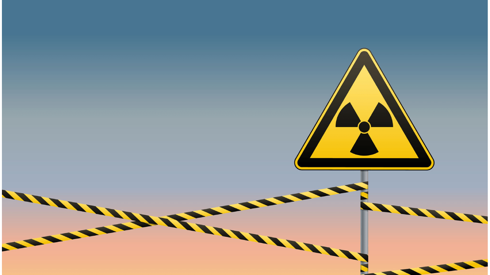

# Chernobyl Game

## Índice
- Visão Geral
- Características
- Pré-requisitos
- Instalação
- Como Jogar
- Estrutura do Código
- Arquivos de Cabeçalho (.h)
- Arquivos de Implementação (.c)
- Contribuindo
- Créditos
- Licença

## Visão Geral
Chernobyl Game é um jogo desenvolvido em linguagem C utilizando a biblioteca Allegro. Neste jogo, você controla um personagem que deve evitar projéteis enquanto navega pelo cenário. É um projeto ideal para iniciantes em desenvolvimento de jogos.

## Características
- **Tela de Menu:** Um botão "Start" para iniciar o jogo.
- **Movimentação do Jogador:** Controle seu personagem usando as teclas W, A, S, D.
- **Desvio de Projéteis:** Um projétil será gerado e deve ser evitado pelo jogador.
- **Indicador de Vida:** O jogador possui uma barra de vida que diminui ao ser atingido.

## Pré-requisitos
- C Compiler (ex: GCC)
- Biblioteca Allegro 5 instalada

## Instalação
1. Clone o repositório.
2. Compile o projeto usando `gcc` ou um compilador compatível.
3. Execute o executável gerado.

## Como Jogar
- Pressione "Start" na tela de menu para iniciar.
- Use as teclas W, A, S, D para movimentar o personagem.
- Evite os projéteis para manter a barra de vida.

## Estrutura do Código
### Arquivos de Cabeçalho (.h)
- **collision.h:** Contém a função `verifica_colisao` que verifica se dois retângulos colidem, utilizada para detectar colisões entre o jogador e projéteis.
- **constants.h:** Define as constantes usadas no jogo, como dimensões da tela, cores e FPS.
- **displays.h:** Declarações para gerenciar e atualizar diferentes telas (estados) do jogo.
- **event_handling.h:** Declarações para gerenciar entradas do usuário, como teclado e mouse, e interações com o jogo.
- **game_logic.h:** Declarações das funções responsáveis pela lógica do jogo, incluindo atualizações de estado e controle de colisões.
- **game_state.h:** Define os diferentes estados do jogo (como MENU, PROLOGO, FASE_1, GAME_OVER) e declara a função `atualizar_estado`.
- **player.h:** Declarações para a estrutura do jogador, incluindo inicialização, atualização e destruição, além de manipulação do estado de invencibilidade e vida.
- **projectile.h:** Declarações para a estrutura do projetil, com funções para inicializar, atualizar e destruir o projétil.
- **rect.h:** Define a estrutura `Rect`, usada para representar retângulos (botões) e auxiliar na verificação de cliques e colisões.
- **rendering.h:** Declarações para funções que lidam com a renderização do jogo, incluindo o desenho do jogador, projéteis e interfaces.
- **resources.h:** Gerenciamento de recursos, como carregar e destruir imagens e fontes utilizadas no jogo.
- **ui.h:** Declarações das funções de interface do usuário, como a barra de vida e a verificação de cliques em retângulos.

### Arquivos de Implementação (.c)
- **collision.c:** Implementa a função `verifica_colisao` para verificar a colisão entre o jogador e projéteis.
- **displays.c:** Gerencia as diferentes telas do jogo e suas transições, incluindo a exibição da tela de menu e game over.
- **event_handling.c:** Implementa a função `handle_event`, que gerencia os eventos de entrada do usuário (teclado e mouse) e atualiza o estado do jogo conforme necessário.
- **game_logic.c:** Implementa a lógica do jogo, como atualizações de estado, colisões e controle da vida do jogador. Inclui a função `update_game` para atualizar o estado do jogo em cada frame.
- **game_state.c:** Define a função `GameState` para gerenciar mudanças de estado no jogo, como iniciar a fase ou exibir o menu.
- **main.c:** Função principal que inicializa o Allegro, carrega os recursos, gerencia o loop do jogo e finaliza os recursos ao sair.
- **player.c:** Implementa as funções para gerenciar o jogador, incluindo movimentação, animação, vida e invencibilidade.
- **projectile.c:** Implementa as funções para gerenciar o projétil, incluindo movimentação, animação e reposicionamento quando ele sai da tela.
- **rendering.c:** Contém as funções de renderização para desenhar o jogador, projetil, barra de vida, e as telas de menu e game over.
- **resources.c:** Carrega e destrói os recursos do jogo (imagens e fontes), gerenciando a memória utilizada.
- **ui.c:** Funções para exibir elementos de UI, como a barra de vida do jogador e verificação de clique nos botões da tela de game over.

## Contribuindo
Contribuições são sempre bem-vindas

## Créditos
Time Maldivas

## Licença
Este projeto é de código aberto e utiliza a licença MIT.
